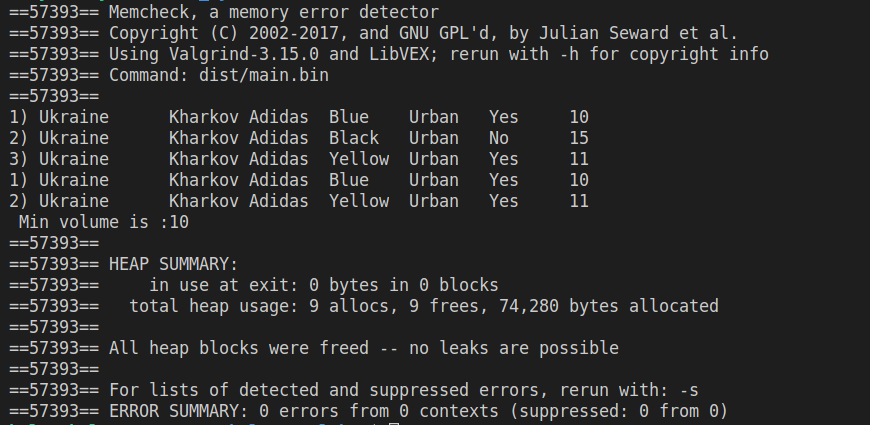
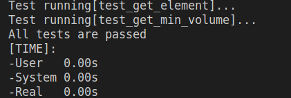
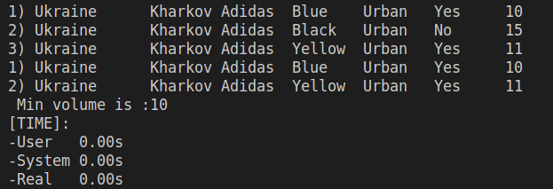

# Лабораторна робота №23. ООП. Вступ до ООП

Мета: набути навичок розробки программ, що використовують принципи ООП

## 1 Вимоги
### 1.1	Розробник
- Носов Микола Володимирович
- Студент групи КІТ-120Б
- 10.05.2021

### 1.2 Загальне завдання
1. Розробити 2 класи:
    - Клас, що відображає сутність базового класу з розділу "Розрахункове завдання". Повинен мати:
        - Конструктор за замовчуванням
        - Конструктор копіювання
        - Конструктор з аргументами
        - Деструктор
    - Клас, що має у собі динамічний масив об’єктів базового класу. Повинен мати методи:
        - Додавання елемента
        - Видалення елемента
        - Отримання елемента по індексу (або ідентифікатору)
        - Вивід всіх елементів на екран
2. Реалізація конструкторів повинна бути продемонстрована за допомогою **списків ініціалізацій**

### 1.3 Індивідуальне завдання
1. Всі поля “базового класу” повинні бути **приватними** та мати публічні **гетери** та **сетери** (модифікатори доступу), використовувати механізм **інкапсуляції**
2. Всі функції, що не повинні змінювати поля поточного об’єкта, повинні бути **константними**
3. Всі аргументи функцій, що не змінюються, по можливості також повинні бути **константними**. Якщо їх не можна зробити константними, у такому разі повинно бути обґрунтування цього
4. В класі-списку метод додавання елемента **не повинен** вводити дані **з клавіатури** або **файлу**, а повинен приймати вже готовий об’єкт для додавання. Метод вводу даних має бути відокремленим
5. Продемонструвати **відсутність витоків пам’яті**
6. Продемонструвати роботу розроблених методів класу-списку за допомогою **модульних тестів**

---

## 2 Опис програми

### 2.1 Функціональне призначення
- Програма призначена для демонстрації вирішення завдань лабораторної роботи №23

### 2.2 Опис логічної структури
**Структура проекту**

```
lab23
├── doc
│   ├── assets
│   │   ├── result.png
│   │   ├── test.png
│   │   └── valgrind.png
│   └── report.md
├── Doxyfile
├── Makefile
├── README.md
├── src
│   ├── barray.cpp
│   ├── barray.hpp
│   ├── backpack.cpp
│   ├── backpack.hpp
│   ├── brand.cpp
│   ├── brand.hpp
│   └── main.cpp
└── test
    └── test.cpp
```

**Призначення та структура розроблених методів**

```c
int main(void)
```

Призначення: головна функція

- Повертає код успішного виходу із програми (0)

---

```c
Backpack* GetBackpack(unsigned index) const;
```

Призначення: повертає рюкзак з колекції 

Опис роботи:
- Перевіряє коректність індексу
- Повертає рюкзак с заданим індексом 

---

```c
Backpack* GetBackpackWithLowestVolume() const;
```

Призначення: повертає рюкзак з мінімальним об'ємом

Опис роботи:
- Перевіряє коректність індексу
- Повертає рюкзак з мінімальним об'ємом

---

```c
void Print();
```

Призначення: виводить на екран всі рюкзаки з колекції

Опис роботи:
- Виводить на екран всі рюкзаки з колекції

---

```c
void AddElement(Backpack* backpack);
```

Призначення: додає рюкзак в колекцію 

Опис роботи:
- Перевіряє наявність вільного місця
- Додає рюкзак в колекцію 

---

```c
void DeleteElement(unsigned index);
```

Призначення: видаляє рюкзак з колекції 

Опис роботи:
- Перевіряє коректність індексу
- Видаляє з колекції

---

Гетери і сетери для полів рюкзака:

```c
unsigned int Backpack::GetVolume() const{
    return volume;
}

string Backpack::GetColor() const{
    return color;
}

string Backpack::GetAppointment() const{
    return appointment;
}

Brand* Backpack::GetBrand() const{
    return brand;
}

bool Backpack::GetLaptopComparament() const{
    return laptop_comparament;
}

void Backpack::SetAppointment(string appointment_){
    appointment = appointment_;
}

void Backpack::SetBrand(Brand* brand_) {

  if (brand != nullptr) {
    delete brand;
  }
  brand = brand_;
}

void Backpack::SetLaptopComparament(bool laptop_comparament_){
    laptop_comparament = laptop_comparament_;
}

void Backpack::SetVolume(unsigned volume_){
    volume = volume_;
}

void Backpack::SetColor(string color_){
    color = color_;
}
```
---

### Важливі фрагменти програми:

Перевірка займаємої памʼяті при виклику деструктора 

```c
Backpack::~Backpack(){
    if(brand != nullptr)
        delete brand;
}
```
---

**Результати перевірки за допомогою Valgrind**

Результати перевірки подані на рисунку 1



Рисунок 1 - Результати перевірки за допомогою Valgrind

---

**Результати модульного тестування**

Результати модульного тестування подані на рисунку 2



Рисунок 2 - Результати модульного тестування

---

## 3 Варіанти використання
Для демонстрації результатів кожної задачі використовується виконання програми у консолі. Швидко зібрати та запустити програму можна за допомогою команди "make run". На рисунку 3 зображені результати роботи програми:



Рисунок 3 - Результати роботи програми

---

## Висновки
Набув навичок розробки програм, що використовують принципи ООП
