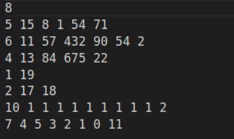
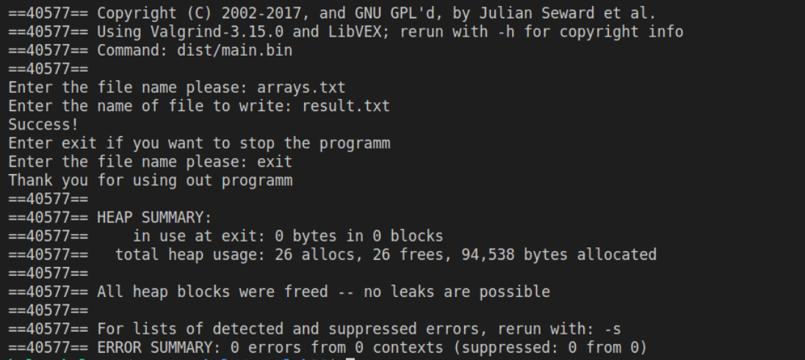
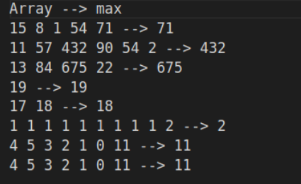
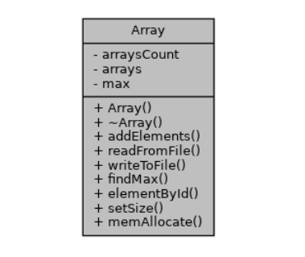
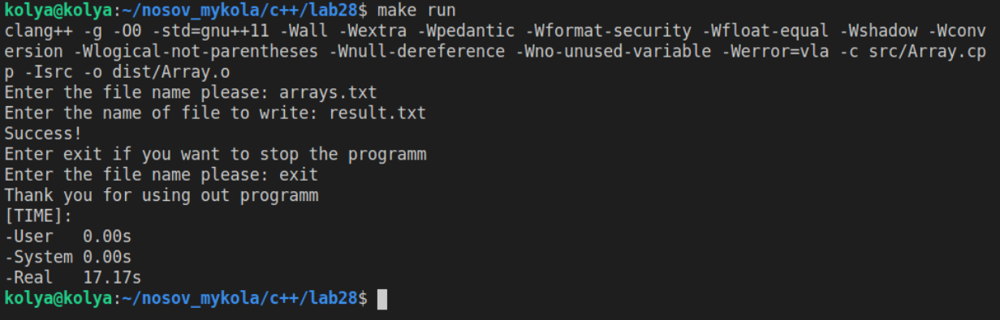

# Лабораторная работа №28. ООП. Обробка виключних ситуацій

Мета: Набути навичок розробки програм, що використовують механізм обробки виключних ситуацій

## 1 Вимоги
### 1.1	Розробник
- Носов Микола Володимирович
- Студент групи КІТ-120Б
- Дата розробки: 2 червень 2021

### 1.2 Загальне завдання
Реалізувати програму, яка буде виконувати наведені нижче дії, поки користувач не введе замість назви файлу рядок "\exit"

- Введення з клавіатури назви вхідного файлу з даними
- Читання даних з файлу
- Виконання індивідуального завдання
- Введення з клавіатури імені вихідного файлу
- Запис результату операції у файл
- Доступ до елемента з індексом слід винести в окрему функцію, що виконує перевірку на можливість виходу за межі масиву
- При обробці виключень цикл не повинен перериватись

### 1.3 Індивідуальне завдання
- Знайти у масиві кількість елементів з максимальним значенням
- Результат операції - масив з кількостей максимальних елементів кожного із вхідних масивів

---

## 2 Опис програми

### 2.1 Функціональне призначення
- Програма призначена для демонстрації вирішення завдань лабораторної роботи №28
- Демонстрація результатів передбачає виконання программи та виведення результатів у консоль

### 2.2 Опис логічної структури
**Структура проекту**
```
lab28
├── doc
│   ├── assets
│   │   ├── doxygen.png
│   │   ├── initial_data.png
│   │   ├── result.png
│   │   ├── test.png
│   │   └── valgrind.png
│   └── report.md
├── Doxyfile
├── Makefile
├── README.md
├── src
│   ├── Array.cpp
│   ├── Array.hpp
│   └── main.cpp
└── test
    └── test.cpp
```

```c
int main(void)
```

Призначення: головна функція

Опис роботи:
- Вирішує загальне та індивідуальне завдання
- Повертає код успішного виходу із програми (0) або (1) у разі помилки

---

```c
void readFromFile(string fileName);
```

Призначення: Зчитує дані з файлу

Опис роботи:
- Видаляє данні з масиву
- Зчитує кількість масивів
- У циклі зчитує розмір кожного масиву та його елементи

Аргументи:
- fileName - імʼя файлу

---

```c
void findMax();
```

Призначення: Оброблює дані, якщо ті були зчитані

Опис роботи: 
- Перевіряє наявність зчитаних даних
- Виділяє пам'ять під результат
- У циклі шукає максимальний елемент
- Записує результат до масиву

---

```c
void writeToFile(string fileName);
```

Призначення: Записує результати обробки до файлу

Опис роботи:
- Перевіряє наявність результатів
- Записує результати до файлу

Аргументи:
- filename -  ім'я файлу

---

```c
int elementById(int count, int id);
```

Призначення: Отримує елемент з отриманих даних, перевіряючи на вихід за межі масивів

Опис роботи:
- Перевіряє коректність індексу
- Повертає елемент з потрібним індексом

Аргументи
- count - Індекс массиву з елементом
- id Індекс елемента в масиві

---

Сеттер для довжини масиву

```c
void setSize(int s);
```

Призначення:
- Встановлює довжину масиву 

Метод для виділення динамічної памʼяті для масивів з файлу та для результуючого масиву
```c
void memAllocate();
```
Опис роботи:
- Виділяє пам'ять для двувимірного масиву
- Виділяє пам'ять для результуючого масиву

### Важливі фрагменти програми:
**Початкові дані**



Рисунок 1 - початкові дані

**Перевірка на витоки пам'яті**



Рисунок 2 - перевірка на витоки пам'яті за допомогою valgrind

**Текстовий файл з результатами**



Рисунок 3 - результат виконання програми


**UML-діаграма класів**



Рисунок 4 - діаграма класу

## 3 Варіанти використання
Для демонстрації результатів кожної задачі використовується виконання програми у консолі. Швидко зібрати та запустити програму можна за допомогою команди "make run". На рисунку 6 зображені результати роботи програми:



Рисунок 5 - результати виконання програми