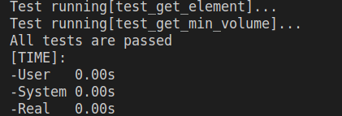

# Лабораторная работа №30-31. ООП. STL. Вступ до Стандартної бібліотеки шаблонів

Мета: Набути навичок розробки програм, що використовують STL

## 1 Вимоги
### 1.1	Розробник
- Носов Микола Володимирович
- Студент групи КІТ-120Б
- Дата розробки: 4 червня 2021

### 1.2 Загальне завдання
Поширити лабораторну роботу з теми "Поліморфізм" (27) наступним чином:
- Замінити масив та CRUD методи роботи з ним на використання STL
- Для предметної галузі "Розрахункове завдання" реалізувати/оновити всі методи роботи з колекцією на використання функції STL
- Додати функцію сортування колекції з використанням функтора
- Додати функцію об'єднання двох класів-списків

### 1.3 Індивідуальне завдання
- Додати можливість об'єднання двох STL-контейнерів типу map. Якщо існують однакові ключі, то значення повинні конкатенуватися

---

## 2 Опис програми

### 2.1 Функціональне призначення
- Програма призначена для демонстрації вирішення завдань лабораторної роботи №30
- Демонстрація результатів передбачає виконання программи та виведення результатів у консоль

### 2.2 Опис логічної структури
**Структура проекту**

```
lab30-31
├── doc
│   ├── assets
│   │   ├── result.png
│   │   ├── test.png
│   │   └── valgrind.png
│   └── report.md
├── Doxyfile
├── Makefile
├── README.md
├── src
│   ├── BackpackList.cpp
│   ├── BackpackList.hpp
│   ├── Backpack.cpp
│   ├── Backpack.hpp
│   ├── Listcontroller.cpp
│   ├── Listcontroller.hpp
│   ├── Brand.cpp
│   ├── Brand.hpp
│   ├── ClothBackpack.cpp
│   ├── LeatherBackpack.hpp
│   ├── LeatherBackpack.cpp
│   └── main.cpp
└── test
    └── test.cpp
```

**Структура та призначення розроблених методів**

```c
int main(void)
```

Призначення: головна функція

Опис роботи:
- Вирішує загальне та індивідуальне завдання. Детальніше про алгоритм розв’язання кожного завдання можна дізнатись із розділу 2.3 Важливі елементи програми
- Повертає код успішного виходу із програми (0) або (1) у разі помилки

---
```c
int main(void)
```

Призначення: головна функція

- Повертає код успішного виходу із програми (0)

---

```c
Backpack* operator[](int index) const
```

Призначення: оператор взяття індекса

Опис роботи:
- Перевіряє коректність індексу
- Повертає рюкзак з колекції 

Аргументи:
- index Індекс 

---

```c
friend std::istream& operator>>(std::istream& in, barray& array)
```

Призначення: оператор введення

Опис роботи:
- Створює потрібні змінні
- Очищає список, якщо він не порожній
- Зчитує інформацію та додає на її основі рюкзаки до списку, поки є ще рядки
- Повертає посилання на базовий клас введення

Аргументи:
- in Посилання на екземпляр базового класа введення
- array Посилання на список 

---

```c
friend std::ostream& operator<<(std::ostream& out, const barray& array)
```

Призначення: оператор виведення

Опис роботи:
- Виводить кожен елемент списка
- Повертає посилання на базовий клас виведення

Аргументи:
- out Посилання на екземпляр базового класа виведення
- array Посилання на список рюкзаків

---

```c
Backpack* GetBackpack(unsigned index) const;
```

Призначення: повертає рюкзак з колекції 

Опис роботи:
- Перевіряє коректність індексу
- Повертає рюкзак с заданим індексом 

---

```c
Backpack* GetBackpackWithLowestVolume() const;
```

Призначення: повертає рюкзак з мінімальним об'ємом

Опис роботи:
- Перевіряє коректність індексу
- Повертає рюкзак з мінімальним об'ємом

---

```c
void Print();
```

Призначення: виводить на екран всі рюкзаки з колекції

Опис роботи:
- Виводить на екран всі рюкзаки з колекції

---

```c
void AddElement(Backpack* backpack);
```

Призначення: додає рюкзак в колекцію 

Опис роботи:
- Перевіряє наявність вільного місця
- Додає рюкзак в колекцію 

---

```c
void DeleteElement(unsigned index);
```

Призначення: видаляє рюкзак з колекції 

Опис роботи:
- Перевіряє коректність індексу
- Видаляє з колекції

---

```c
Backpack* Backpack::FillFromString(string str)
```
Призначення:
- заповнює змінну типу рюкзак інформацією з рядка

Опис роботи:
- заповнення змінної по кожному полю 

```c
string Backpack::ToString() const
```
Призначення:
- заповнює рядок інформацією зі змінної типа рюкзак

Опис роботи:
- заповнення рядка та повернення його з функції


Гетери і сетери для полів рюкзака:

```c
unsigned int Backpack::GetVolume() const{
    return volume;
}

string Backpack::GetColor() const{
    return color;
}

string Backpack::GetAppointment() const{
    return appointment;
}

Brand* Backpack::GetBrand() const{
    return brand;
}

bool Backpack::GetLaptopComparament() const{
    return laptop_comparament;
}

void Backpack::SetAppointment(string appointment_){
    appointment = appointment_;
}

void Backpack::SetBrand(Brand* brand_) {

  if (brand != nullptr) {
    delete brand;
  }
  brand = brand_;
}

void Backpack::SetLaptopComparament(bool laptop_comparament_){
    laptop_comparament = laptop_comparament_;
}

void Backpack::SetVolume(unsigned volume_){
    volume = volume_;
}

void Backpack::SetColor(string color_){
    color = color_;
}
```
---

```c
void UniteMaps(std::map<std::string, std::string>& first, std::map<std::string, std::string>& second)
```

Призначення: об'єднує карти, конкатенуючи рядки, які повторюються

Опис роботи:
- Об'єднує карти, конкатенуючи рядки, які повторюються

Аргументи:
- first Карта, в яку буде поміщено результат
- second Карта, яка об'єднується з першою

---

### Важливі фрагменти програми:

Перевантаження методів у класах спадкоємцях

```c
std::string display() override {
        return "Leather" + std::to_string(GetVolume());
    };
    virtual bool isLeather() override {
        return true;
    };
    virtual bool isCloth() override {
        return false;
    };
```

```c
std::string display() override
    {
        return "CLoth" + std::to_string(GetVolume());
    };
    virtual bool isLeather() override
    {
        return false;
    };
    virtual bool isCloth() override
    {
        return true;
    };
```

**Початкові дані**

На рисунку 1 зображені початкові дані:


Рисунок 1 - Початкові дані

---

**Uml-діаграми**

Ієрархія класі зображена на рисунку 3 


Рисунок 3 - ієрархія класів

Діаграми класів зображені на рисунку 4


---

**Результати перевірки за допомогою Valgrind**

Результати перевірки подані на рисунку 3


Рисунок 3 - Результати перевірки за допомогою Valgrind

---

**Результати модульного тестування**

Результати модульного тестування подані на рисунку 4



Рисунок 4 - Результати модульного тестування

---

---

## 3 Варіанти використання
Для демонстрації результатів кожної задачі використовується виконання програми у консолі. Швидко зібрати та запустити програму можна за допомогою команди "make run". На рисунку 6 зображені результати роботи програми:


Рисунок 6 - Результати роботи програми

---

## Висновки
Набув навичок розробки програм, що використовують STL.
