# Лабораторна робота №10. Вступ до документації проекту

 **Мета: Розробити повноцінні звіти для лабораторної роботи «Функції» у двох форматах: Markdown та doc** 

## 1 Вимоги

### 1.1 Розробник

- Носов Микола Володимирович;
- студент групи КІТ-120Б;
- 7-dec-2020.

### 1.2 Загальне завдання
1. Розробити повноцінні звіти для лабораторної роботи «Функції» у двох форматах: Markdown та doc		 

### 1.3 Індивідуальне завдання:

1. Переробити програми, що були написані протягом 5 та 6 лабораторної роботи так, щоб обчиснення проходило поза головної функції

2. Реалізувати функцію, що визначає, скільки серед заданої послідовності чисел таких пар, у котрих перше число менше наступного 

## 2 Опис програми 

### 2.1 Функціональне призначення

**Програма призначена для**:
- знаходження НОД 2 чисел;
- перевірки на білета на “щастливість”;
- перевірки числа, і визначення, чи є воно простим;
- перевірки числа, і визначення, чи є ідеальним;
- знаххождення квадратного кореня числа;
- центрування слів у строчці;
 
### 2.2 Логічна структура проекту 

#### Логічна структура проету (див рис 1) :

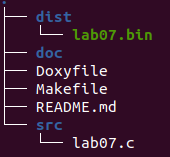

*Рисунок 1 - структура проекту*

**1.Функція знаходження НОД (див рис. 2)**

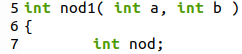

*Рисунок 2 - фрагмент коду*

**Призначення** :
- Знаходження найбільшого спільного дільника ;

**Аргументи** :
- 2 числа;

**Опис роботи** :
- визначення, яке число число є більшим;
- ділення більшого числа на меньше по %, доки вони ≠ 0;
- сумуємо 2 чилса;

**2.Функція визначення щасливого білетика (див рис. 3)**

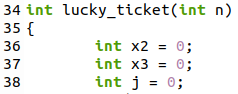

*Рисунок 3 - фрагмент коду*

**Призначення** :
- Визначення, чи є білетик щасливим;

**Аргументи** :
- 6-ти значне число;

**Опис роботи** :
- розбиття 6-ти значного числа на 6 цифр;
- сума перших трьох чисел;
- сума чисел, що залишилися;
- якщо суми однакові - білетик щасливий;

#### Cхема алгоритму (див рис 4) :

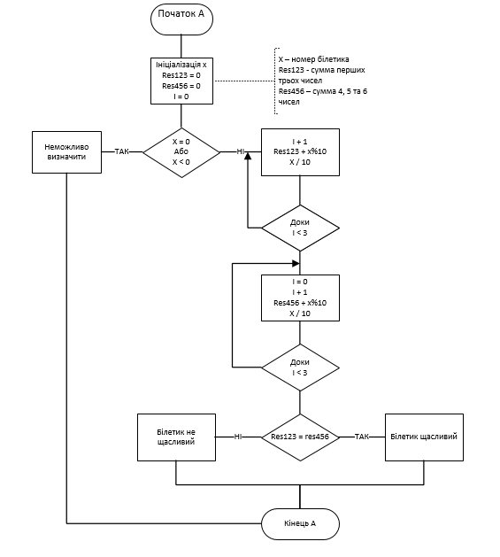

*Рисунок 4 - креслення алгоритму* 

**3.Функція визначення простого числа (див рис. 5)**

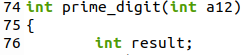

*Рисунок 5 - фрагмент коду*

**Призначення** :
- Визначення, чи є число простим;

**Аргументи** :
- Число

**Опис роботи** :
- Ділити число на всі числа від 1 до квадратного кореня заданого числа;
- Якщо число ділиться на ціло - число не просте, в іншому випадку - просте;

**4.Функція визначення ідеально числа (див рис.6)**

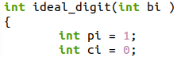

*Рисунок 6 - фрагмент коду*

**Призначення** :
- Визначення, чи є число ідеальним;

**Аргументи** :
- Число;

**Опис роботи** :
- знаходження дільників числа;
- якщо сума дільників = самому числу - воно ідеальне;

**5.Функція знахождення квадратного кореня (див рис 7)**

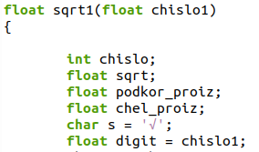

*Рисунок 7 - фрагмент коду*

**Призначення** :
- Знахождення квадратного кореня;

**Аргументи** :
- Число

**Опис роботи** :
- знаходження дільників числа;
- попарне винесення дільників числа із під знаку кореня;
- знаходження кореня за теоремою дотичних Ньютона;

#### Отримаємо відповідь у такому вигляді (див рис 8 ):

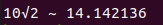

*Рисунок 8 - результат роботи програми* 

**6.Функція центрування слова у рядку (див рис 9)**

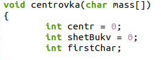

*Рисунок 9 - фрагмент коду*

**Призначення** :
- Центрування слова або словосполучення у рядку;

**Аргументи** :
- Слово, що потребує цетрування;

**Опис роботи** :
- Знаходження першої букви;
- Підрахунок кількості букв;
- Розрахунок необхідної кількости символів центрування;
- Заповнення рядка буквами та символами “_”;

#### Отримаємо відповідь у такій формі (див рис 10)
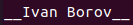

*Рисунок 10 - результат роботи програми* 

#### Схеми алгоритму (див рис 11, 12, 13):

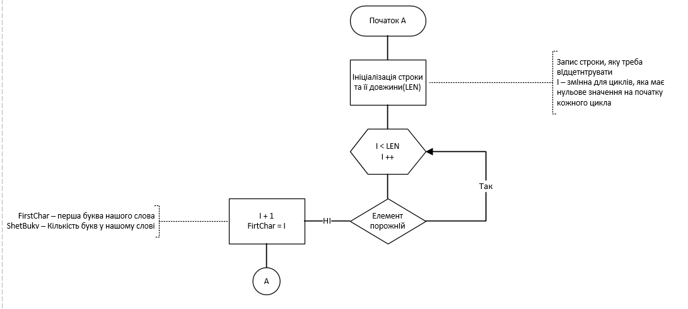

*Рисунок 11 - 1 частина креслення алгоритму*

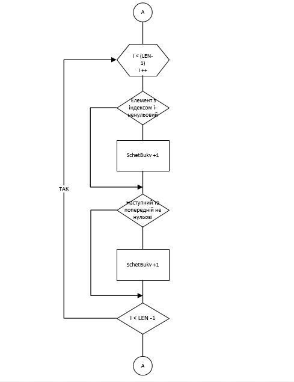

*Рисунок 12 - 2 частина креслення алгоритму*

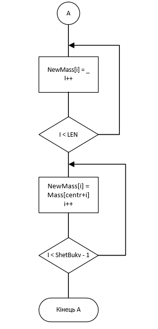

*Рисунок 13 - 3 частина креслення алгоритму*

**7 Функція з варіативною кількістю агрументів (див рис 14)**

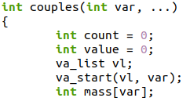

*Рисунок 14 - фрагмент коду*

**Призначення** :
- Знаходження кількості пар чисел, перше число якої меньше за наступне;

**Аргументи** :
- Ряд чисел;

**Опис роботи** :
- Программа порівнює 2 числа, що стоять поруч;
- Якщо число меньше наступного - образовується пара;

#### Схема алгоритму (див рис 15):

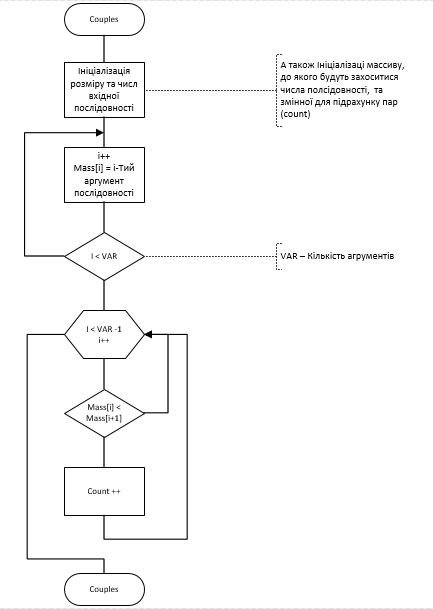

*Рисунок 15 - креслення алгоритму* 

## 3 Варіанти використання
Для обчислення результатів мы використовємо gdb - дебагер, влаштований в
утиліту gcc.
Щоб подивитися на резутат, ми повинні:
-при компіляції вказати рівень інформації для відлатки за допомогою -g; -відкомпілювати наш файл з кодом;
-запустити його бінарний файл у відлагоднику;
-вказати им’я функції, як точку зупину щоб подивитьсь на значення змінних;
-запускаємо програму та вводимо: “info locals”;
## Висновок:
Протягом даної лабораторної роботи ми навчилися писати повноцінні звіти у форматах doc та markdown.
Переглянути звіт у форматі Markdown можна у папці doc даної лабораторної , яка знаходиться на зовнышньому репозиторії gitlab.

