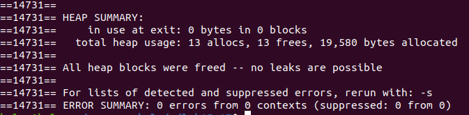
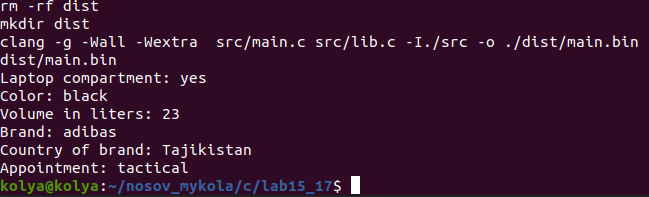
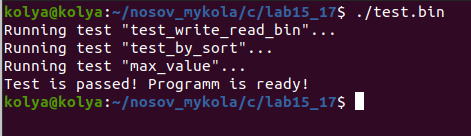

# Лабораторна робота №15/17. Структуровані типи даних. Модульні тести

 **Мета: навчитися працювати з структурами даних, а також написати тест для програми** 

## 1 Вимоги

### 1.1 Розробник

- Носов Микола Володимирович;
- студент групи КІТ-120Б;
- 28-feb-2020.

### 1.2 Загальне завдання

1. Створити структуру даних, що відображає тип базового классу

### 1.3 Індивідуальне завдання:

1. Записати ознаки обʼєкта у файл
2. Відсортувати масив
3. Відсортувати масив елементів за вказаним критерієм
4. Реалізувати функцію №1 з категорії "Методи для роботи з колекцією"
5. Розробити функцію, яка генерує елемент прикладної галузі
6. Виконати запис та читання массиву структур у двох форматах : текстовому та бінарному

## 2 Опис програми 

### 2.1 Функціональне призначення

Программа призначена для:

 - демонстрації виконання прикладних задач лабораторної роботи №15 та №17
 
### 2.2 Логічна структура проекту 

#### Логічна структура проету :

 - Структура проекту
  
``` 
.
├── doc
│   ├── assets
│   │   ├── work(1).png
│   │   ├── work(2).png
│   │   ├── main_func.png
│   │   ├── valgrind.png
│   │   ├── cppcheck.png
│   │   └── define.png
│   └──readme.md
├── test
│   └── test.c
├── Doxyfile
├── Makefile
├── README.md
├── check.txt
├── .gitignore
└── src
    ├── lib.c
    ├── lib.h
    └── main.c
```
 
**Основна функція:**
> int main(void);


**Функції програми**
```c
unsigned char fill_massive(struct backpack* back, unsigned char count)
```

Призначення: заповнює параметри структур back з переданого масиву псевдовипадковими числами

Опис роботи:
 - Створення змінних
 - Заповнення масиву

Аргументи:
 - *back - Масив структур backpack
 - count - Кількість структур в масиві

---

```c
void print_massive(struct backpack* back, unsigned char count)
```

Призначення: виводить в консоль масив структур back з переданого масиву

Опис роботи:
- Створення змінних
- Виведення масиву

Аргументи:
 - *back - Масив структур backpack
 - count - Кількість структур в масиві

---

```c
int write_text(struct backpack *p)
```

Призначення: записує дані у текстовому вигляді

Опис роботи:
- Відкриття файлу
- Запис

Аргументи:
 - *back - Масив структур backpack
 
 ---
 
```c
int read_text(char * filename);
```

Призначення: читае дані з файлу у текстовому вигляді 

Опис роботи:
- Відкриття файлу
- Зчитування інформації

Аргументи:
 
 - char * filename - імʼя файлу
 
 ---
 
```c
unsigned char write_bin(struct backpack *back, unsigned char count);
```

Призначення: запис інформації у бінарному вигляді

Опис роботи:
- Відкриття файлу
- запис

Аргументи:
 - *back - Масив структур backpack
 - count - Кількість структур в масиві
 
 ---
 
```c
void search(char input[], struct backpack *back);
```

Призначення: шукає потрібні елементи за заданим критерієм

Опис роботи:
- Порівнює строку структури зі вхідними данними
- Виводить ті структури, які потрібні

Аргументи:
 - *back - Масив структур backpack
 - char input[] - Критерій

---

```c
void sort_by_volume(struct backpack *back)
```
Призначення: сортує масив

Опис роботи:
- Порівнює сусідні елементи масиву 
- Міняє місцями, якщо зліва більший елемент

Аргументи:
 - *back - Масив структур backpack

 
**Блок схеми алгоритму**

- Схема знаходження потрібних структур(див рис 1)


_Рисунок 1 - схема алгоритму_ 
 
**Макровизначення**

- Максильмальний об'єм рюкзаку у літрах

> #define MAX_VOLUME_OF_BACKPACK 20 

- Кількість структур у масиві

> #define BACKPACKS_COUNT 30

### 2.3 Важливі фрагменти коду 

 - Створення нових типів  

```c
struct brand
{
	char name[15];
	char country[15];
};
struct backpack
{
	char laptop_compartment[4];
	char color[10];
	int volume;
	struct brand brand_1;
	char appointment[10];
};
```

 - Читання з файлу у тектовому вигляді 
 
```c
 FILE * fp;
    char *c;
    int i; 
    
    int size = sizeof(struct backpack);
    struct backpack * ptr = (struct backpack *) malloc(size);
 
    if ((fp = fopen(filename, "rb")) == NULL)
    {
        perror("Error occured while opening file");
        return 1;
    }
    c = (char *)ptr;
    while ((i = getc(fp))!=EOF)
    {
       	*c = i;
        c++;
    } 
```
 - Пошук за кольором 

```c
	for (int i = 0; i < BACKPACKS_COUNT; i++)
	{
		if (strcmp(back[i].color, input))
		{
			printf("Sorry, we don't have %s bakcpacks\n", input);
			break;
		}
	}
	for (int i = 0; i < BACKPACKS_COUNT; i++)
	{
		if(strcmp(back[i].color, input) == 0)
		{
			print(back[i]);
		}
	}
	printf("Please, choose the brand of backpack :\n");
	search_1(input, back);	
```
### Перевірка наявності помилок витоків пам'яті(див рис 2 та 3)


_Рисунок 2 - перевірка помилок за допомогою cppcheck_



_Рисунок 3 - перевірка витоків пам'яті за допомогою valgrind_

## 3 Варіанти використання

**Результат роботи программи(див рис 4,5,6)**



_Рисунок 4 - інформація про об'єкт_

.PNG)

_Рисунок 5 - структури, які підходять за 2 парметрами_



_Рисунок 6 - тест програми_

### Інстуркція щодо використання 

- склонувати дані даного репозиторія
- прописати ключову команду "make" у консоль
- вибрати колір рюкзака
- вибрати бренд
- для документації введіть "doxygen" --> "cd/dist/html" --> "firefox index.html"

## Висновок:

### В умовах даної лабраторної роботи ми навчились працювати з структурованими тапами даних, а також написали тест нашої програми


