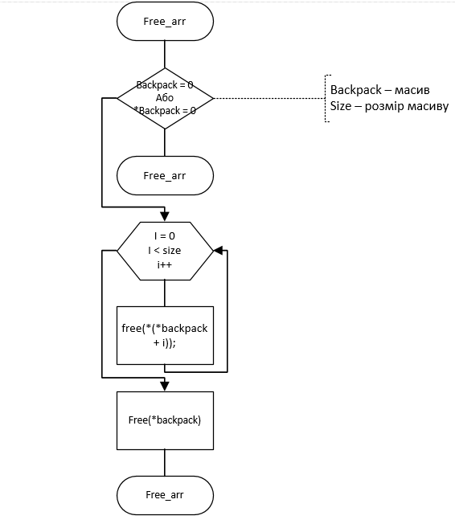
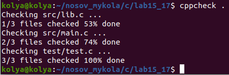
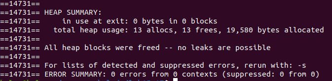
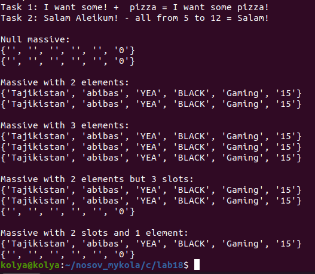

# Лабораторна робота №18. Структуровані типи даних. Модульні тести

 **Мета: навчитися працювати з динамічними масивами** 

## 1 Вимоги

### 1.1 Розробник

- Носов Микола Володимирович;
- студент групи КІТ-120Б;
- 14-mar-2020.

### 1.2 Загальне завдання

1. Розробити функцію, яка вставляє один рядок в i-у позицію іншого
2. Розробити функцію для видалення з рядка всіх символів у заданому діапазоні
3. За допомогою функцій memcpy і memset створити функції додавання і видалення елементів динамічного масиву прикладної області
4. Додати модульні тести

## 2 Опис програми 

### 2.1 Функціональне призначення

Программа призначена для:

 - демонстрації виконання прикладних задач лабораторної роботи №18
 
### 2.2 Логічна структура проекту 

#### Логічна структура проету :

 - Структура проекту
  
``` 
.
├── doc
│   ├── assets
│   │   ├── work(1).png
│   │   ├── work(2).png
│   │   ├── main_func.png
│   │   ├── valgrind.png
│   │   ├── cppcheck.png
│   │   └── define.png
│   └──readme.md
├── test
│   └── test.c
├── Doxyfile
├── Makefile
├── README.md
├── check.txt
├── .gitignore
└── src
    ├── lib.c
    ├── lib.h
    └── main.c
```
 
**Основна функція:**
> int main(void);

Призначення :
 - вирішує поставлені задачі
 - повертає 0 у разі успішного завершення програми

**Функції програми**
```c
void insert(char *base, char *insert, size_t pos);
```

Призначення: Вставляє один рядок в інший в певну позицію 

Опис роботи:
 - Ініціалізація пам'яті нулями для правильної роботи функцій конкатенації
 - Формуємо результуючий рядок
 - Копіювання тимчасового рядка в результуючий рядок

Аргументи:
 - *base - основний рядок
 - *insert - рядок, який вставляється
 - pos - позиція, на яку встає другий рядок
---

```c
void reduce(char *base, size_t begin, size_t end);
```

Призначення: скорочує рядок на певну кількість елементів

Опис роботи:
 - видалення елементів массиву
 - перевиділення памʼяті під результуючий рядок

Аргументи:
 - *base - рядок 
 - begin - елемент з якого починаємо видалення
 - end - елемент яким закінчуємо видалення
---

```c
void add_backpack(backpack_t **backpack, size_t i, backpack_t *add_element);
```

Призначення: Додає до порожнього массиву елемент прикладної галузі

Опис роботи:
 - копіювання елемента на певну позицію массива

Аргументи:
 - backpack - массив
 - i - позиція в масиві, в яку треба додати елемент
 - add_element - елемент, який вносимо в масив
 
 ---
 
```c
void remove_backpack(backpack_t **backpack, size_t i);
```

Призначення: Видаляє елемент з масиву 

Опис роботи:
 - Видалення елемента з масиву

Аргументи:
 
 - backpack - масив елементів
 - i - позиція елемента, який видаляємо
 ---
 
```c
void print_arr(backpack_t **backpack, size_t size);
```

Призначення: виведення масиву елементів на екран

Опис роботи:
 - виводить кожний елемент масиву

Аргументи:
 - backpack - масив елементів
 - size - розмір масиву
 
 ---
 
```c
void free_arr(backpack_t ***backpack, size_t size);
```

Призначення: звільняє памʼять, виділену під масив

Опис роботи:
 - звільняє пам'я ,виділену під кожний елемент
 - звільняє пам'ять виділену під масив

Аргументи:
 - backpack - масив
 - size - розмір масиву
 
---

```c
char create_arr(backpack_t ***backpack, size_t size);
```
Призначення: виділяє памʼять для масиву

Опис роботи:
 - виділяє памʼять для масиву
 - виділяє пам'ять для кожного елемента масиву

Аргументи:
 - backpack - масив 
 - size - розмір масиву
 
**Блок схеми алгоритму**

- Схема звільнення памʼяті(див рис 1)



_Рисунок 1 - схема алгоритму_ 
 
**Макровизначення**
```c
#define BASE "I want some!" - рядок, в який вставляємо 
#define INSERT " pizza" - рядок, який вставляємо
#define POSITION 11 - місце, куди вставляємо
#define CUT_OFF "Salam Aleikum!" - рядок, який зменьшуємо
#define FROM 5 - місце, з якого починається зменьшення
#define TO 12 - місце, яким завершується зменьшення
#define SIZE 8 - кількість елементів масиву
```
### 2.3 Важливі фрагменти коду 

- Виділення памʼяті

```c
char create_arr(backpack_t ***backpack, size_t size)
{
	if ((*backpack = (backpack_t **)
	calloc(size, sizeof(backpack_t *))) == 0)
		return 0;

	for (int i = 0; i < size; ++i) 
	{
		if ((*(*backpack + i) = (backpack_t *)malloc(
			     sizeof(backpack_t))) == 0) 
		{
			free_arr(backpack, i);
			return 0;
		}
	}
	return 1;
}
```

 - Звільнення памʼяті
```c
 void free_arr(backpack_t ***backpack, size_t size)
{	
	if (backpack == 0 || *backpack == 0)
		return;

	for (int i = 0; i < size; ++i)
		free(*(*backpack + i));

	free(*backpack);
}
```
 - Форматоване виведення у консоль
```c
	fvoid print_arr(backpack_t **backpack, size_t size)
{
	for(int i = 0; i < size; i++)
	printf("{'%s', '%s', '%s', '%s', '%s', '%d'}\n",
	backpack[i]->brand_1.country, 
	backpack[i]->brand_1.name,
	backpack[i]->laptop_compartment,
	backpack[i]->color,
	backpack[i]->appointment,
	backpack[i]->volume);
}	
```
### Перевірка наявності помилок витоків пам'яті(див рис 2 та 3)



_Рисунок 2 - перевірка помилок за допомогою cppcheck_



_Рисунок 3 - перевірка витоків пам'яті за допомогою valgrind_

## 3 Варіанти використання

**Результат роботи программи(див рис 4)**



_Рисунок 4 - робота програми_


### Інстуркція щодо використання 

- склонувати дані даного репозиторія
- прописати ключову команду "make" у консоль
- вибрати колір рюкзака
- вибрати бренд
- для документації введіть "doxygen" --> "cd/dist/html" --> "firefox index.html"

## Висновок:

### В умовах даної лабраторної роботи ми навчились працювати динамічними масивами, додавати та видаляти елементи з динамічних масивів


