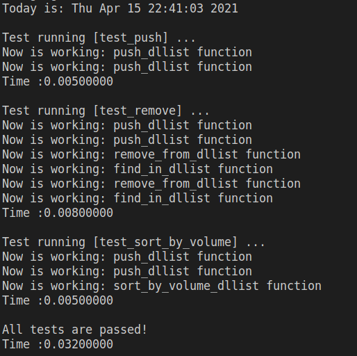

# Лабораторна робота №19-20.Динамічні списки. Макровизначення

 **Мета: навчитися працювати з звʼязними списками** 

## 1 Вимоги

### 1.1 Розробник

- Носов Микола Володимирович;
- студент групи КІТ-120Б;
- 14-apr-2020.

### 1.2 Загальне завдання
1. Проект повинен складатися як мінімум з 6-ти файлів (main.c, test.c, list.h, list.c, data.h, data.c)
2. Якщо визначено макроозначень DEBUG, то для кожної функції:
- Виводити поточну дату і час
- Виводити назву поточної функції
- При завершенні програми вивести загальний час роботи програми
3. Розробити модульні тести, модифікувавши їх таким чином, щоб:
- При запуску кожного тесту виводилося його ім'я
- При завершенні тесту виводилося час виконання тесту
- Після завершення всіх тестів виводилося загальний час тестування
4. Продемонструвати відсутність витоків пам'яті
5. Використовувати двоспрямований список
6. Реалізувати діалоговий режим спілкування з користувачем
7. Виконати сортування списку по одному з критеріїв. При цьому обмін місцями обов'язково повинен виконуватися обміном їх покажчиків
8. Реалізувати функції для:
- читання даних з файлу (за допомогою fscanf)
- записи даних в файл (за допомогою fprintf)
- виведення вмісту списку на екран
- видалення об'єкта зі списку
- вставки об'єкта після будь-якого елементу в списку
- додавання елемента в кінець списку 

### 1.3 Індивідуальне завдання
1. Виконати завдання на "відмінно"

## 2 Опис програми 

### 2.1 Функціональне призначення

Программа призначена для:

 - демонстрації виконання прикладних задач лабораторної роботи №19-20, шляхов виведення у консоль
 
### 2.2 Логічна структура проекту 

#### Логічна структура проету :

 - Структура проекту
  
``` 
.
├── doc
│   ├── assets
│   │   ├── work(1).png
│   │   ├── work(2).png
│   │   ├── main_func.png
│   │   ├── valgrind.png
│   │   ├── cppcheck.png
│   │   └── define.png
│   └──readme.md
├── test
│   └── test.c
├── Doxyfile
├── Makefile
├── README.md
├── .gitignore
└── src
    ├── list.c
    ├── list.h
    ├── data.c
    ├── data.h
    └── main.c
```
 
**Основна функція:**
> int main(void);

Призначення :
 - вирішує поставлені задачі
 - повертає 0 у разі успішного завершення програми

**Функції програми**
```c
dllist_t *create_dllist();
```

Призначення: Створює двузвʼязний список 

Опис роботи:
 - Виділення пам'яті
 - Встановлення вказівників початку та кінця списку на NULL
 - Встановлення довжини списку на 0
 - Повернення вказіника на стуктуру списку 
---

```c
void free_dllist(dllist_t **list);
```

Призначення: Звільнення займаємої пам'яті списком 

Опис роботи:
 - Встановлення вказівника на кінець списка
 - Циклічне звільнення елементів з кінця до початку
 - Звільнення першого елемента
 - Звільнення пам'яті відведену під структуру списка 

Аргументи:
 - dllist_t **list - вказівник на вказівних на структуру списка
---

```c
element_t *find_in_dllist(dllist_t *list, size_t pos);
```

Призначення: Пошук елемента за індексом

Опис роботи:
 - Встановлення вказівника на початок списка
 - Циклічний прохід по елементам
 - Повернення покажчика на потрібний елемент

Аргументи:
 - dllist_t *list - список
 - size_t pos - індекс

 ---
 
```c
void push_dllist(dllist_t *list, backpack_t *element);
```

Призначення: Додавання елементу у список 

Опис роботи:
 - Встановлення покажчика отсаннього елменту списку на область памʼяті, де знаходиться той елемент, що потрібно додати

Аргументи:
 
 - dllist_t *list - список
 - backpack_t *element - елемент, що додаємо 
 ---
 
```c
void remove_from_dllist(dllist_t *list, size_t pos);
```

Призначення: Видалення елемента зі списку по індексу

Опис роботи:
 - Викликаємо функцію пошуку, яка поверне нам покажчик на той елемент, що потрібно видалити
 - Звертаємося до сусідніх елементів
 - Звільняємо пам'ять

Аргументи:
 - dllist_t *list - список 
 - size_t pos - індекс
 
 ---
 
```c
void write_to_file(dllist_t *list, const char *filename);
```

Призначення: Запис полів структур списка у файл

Опис роботи:
 - Запис у файл у текстовому вигляді

Аргументи:
 - dllist_t *list - список
 - const char *filename - ім'я файлу
 
---

```c
void read_from_file(dllist_t *list, const char *filename);
```
Призначення: Читання структур списка з файлу

Опис роботи:
 - Зчитує поля списку у текстовому вигляді з файлу

Аргументи:
 - dllist_t *list - список
 - const char *filename - ім'я файлу

---

```c
void print_dllist(dllist_t *list);
```
Призначення: Виведення списку у консоль

Опис роботи:
 - Виводить список у консоль

Аргументи:
 - dllist_t *list - список

---

```c
void sort_by_volume_dllist(dllist_t *list);
```
Призначення: Сортування елементів списку за зростанням по об'єму рюкзака

Опис роботи:
 - Сортує список шляхом обміну покажчиків

Аргументи:
 - dllist_t *list - список

```c
backpack_t  *get_backpack_from_user();
```
Призначення: Заповнення структури користувачем для додавання її у список

Опис роботи:
 - Отримує інформацію за допомогою scanf
 - Повертає вказівник на область памʼяті, в якій знаходиться потрібна структура

```c
void time_now();
```
Призначення: Виведення на єкран поточної дати та часу

Опис роботи:
 - Виводить на єкран дату та час
---

**Блок схеми алгоритму**

- Знаходження елемента(див рис 1)


_Рисунок 1 - схема алгоритму_ 
 

### 2.3 Важливі фрагменти коду 

**Макровизначення**
```c
#define PUSH 1 - додавання у список
#define FIND 2 - знаходження елемента
#define REMOVE 3 - видалення зі списку
#define PRINT 4 - виведення списку у консоль
#define SORT 5 - сортування списку
#define FWRITE 6 - запис у файл
#define FREAD 7 - читання з файлу
#define EXIT 8 - вихід
#define INCORRECT 0 - некоректна операція
```

**Структури даних**

- Структура для бренда

```c
typedef struct brand
{
	char name[15];
	char country[15];
}brand_t;
```
- Структура для рюкзака
```c
typedef struct backpack
{
	char laptop_compartment[4];
	char color[10];
	int volume;
	brand_t brand_1;
	char appointment[10];
}backpack_t;
```
- Структура для елементу списка
```c
typedef struct element element_t;

struct element {
	backpack_t data;
	element_t *next;
	element_t *prev;
};
```
- Стуктура для двузвʼязного списку

```c
typedef struct dllist {
	element_t *head;
	element_t *tail;
	size_t size;
} dllist_t;
```
- Додавання елементу

```c

void push_dllist(dllist_t *list, backpack_t *element)
{
	print_func_name(__FUNCTION__);
	element_t *prev;

	element_t *insert;

	if (!list || !element)
		return;

	if (list->tail == NULL)
	{
		insert = list->head = list->tail = malloc(sizeof(element_t));
		if (list->head == NULL)
			return;

		insert->prev = insert->next = NULL;

		memcpy(&insert->data, element, sizeof(backpack_t));
	}
	else
	{
		prev = list->tail;

		insert = prev->next = malloc(sizeof(element_t));
		if (prev->next == NULL)
		{
			return;
		}

		insert->prev = prev;
		insert->next = NULL;

		list->tail = insert;

		memcpy(&insert->data, element, sizeof(backpack_t));
	}
	list->size++;
}
```
 - Звільнення памʼяті

```c
void free_dllist(dllist_t **list)
{
	if (list != NULL && *list != NULL && (*list)->size != 0)
	{
		/* Get last element */
		element_t *iter = (*list)->tail;
		/* Delete all elements */
		while (iter->prev != NULL)
		{
			iter = iter->prev;
			free(iter->next);
		}
		free(iter);
		free(*list);
		*list = NULL;
	}
	return;
}
```
 - Видалення елемента
```c
void remove_from_dllist(dllist_t *list, size_t pos)
{
	print_func_name(__FUNCTION__);
	element_t *element;

	if (list == NULL)
	{
		printf("Can't remove\n");
		return;
	}

	if (list->size == 0 || pos >= list->size)
		return;
	element = find_in_dllist(list, pos);

	if (list->size == 1)
		list->head = list->tail = NULL;
	else if (pos == 0)
	{
		element->next->prev = NULL;
		list->head = element->next;
	}
	else if (pos == list->size - 1)
	{
		element->prev->next = NULL;
		list->tail = element->prev;
	}
	else
	{
		element->prev->next = element->next;
		element->next->prev = element->prev;
	}
	free(element);
	list->size--;
}
```
### Перевірка наявності помилок витоків пам'яті(див рис 2)


_Рисунок 2 - перевірка витоків пам'яті за допомогою valgrind_

### Результат модульного тестування



_Рисунок 3 - тестування_

## 3 Варіанти використання

**Результат роботи программи(див рис 4)**


_Рисунок 4 - робота програми_


### Інстуркція щодо використання 

- make run - для запуску програми

## Висновок:

### В умовах даної лабраторної роботи було набуто практичного досвіду із роботою з такую структурою даних, як звʼязний список, а з роботою з макровизначеннями 